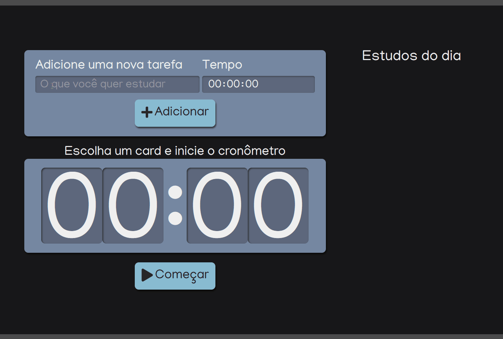

# Tarefas Agendadas

Este projeto ajuda a gerenciar o tempo nos estudos, conseguimos atribuir um tempo para cada tarefa e ao selecionarmos na lista, 
o tempo da tarefa vai para o cronômetro e assim que clicamos em começar, a contagem regressiva se inicia. 


## Demo



## Color Reference

| Color             | Hex                                                                |
| ----------------- | ------------------------------------------------------------------ |
| Azul claro |  #88BCD1 |
| Azul marinho |  #7687A1 |
| Verde musgo |  #566F42 |
| Preto |  #171717 |
| Cinza|  #4C4C4C |


## Features

- Fullscreen mode
- Cross platform


## Lessons Learned

Aprendi a tipar os elementos comuns de uma aplicação frontend.


## Run Locally

Clone the project

```bash
  git clone https://github.com/caducoder/react-tarefas-agendadas.git
```

Go to the project directory

```bash
  cd react-tarefas-agendadas
```

Install dependencies

```bash
  npm install
```

Start the server

```bash
  npm start
```


## Tech Stack

- React
- Typescript
- Sass
- React Icons


